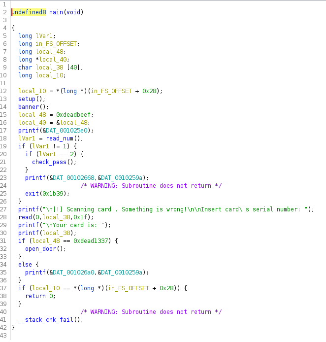
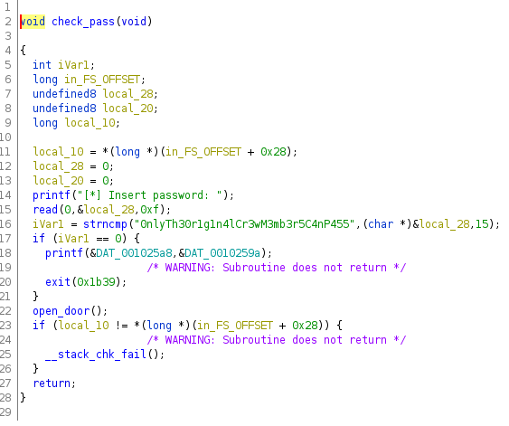
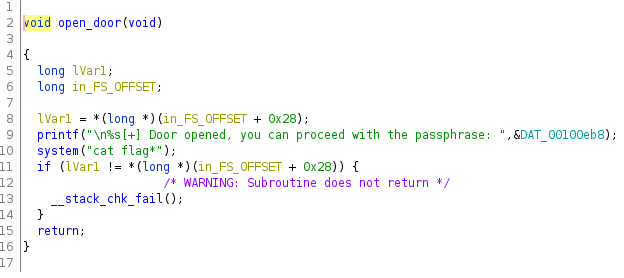

# Cyber Apocalypse 2022 CTF - PWN: SP_Entrypoint
-------------------------------------------------

In the cahllenge Starting_Point we were given a library and a executable called "*sp_entrypoint*".
We can try and run the executable. We are prompted to insert a password. Obviously our input will be false, because we don't know the password. Now we are prompted to insert the card's serialnumber.
If we input something, the program exits.

Let's start up Ghidra and look at the code behind this executable!
After the first start of ghidra, we let ghidra analyze the program and then open the functions folder.
We can have a look at the main function, to try to understand th program.

In the main function we can see the prompt called as *banner()*. In line 18 our input gets read in.
The input gets compared in line 19 and 20. Let's have a closer look at those 2 lines.
First our inserted number is compared to 1 if this check fails, our number gets compared to 2.
If the check with 2 is true, we call the function *check_pass()* every other input will result in the program exiting.
So let's have a look at the *check_pass()* function.

We can see yet another input that gets read in in line 15. This input gets compared to "*0nlyTh30r1g1n4lCr3wM3mb3r5C4nP455*".
We now have to know what the *strncmp()* function does. The *strncmp()* function compares the attribute it's given with the string specified. The last attribute let's us know how many characters are compared.
If the provided string is equal to the specified string, the return is 0, if the given string has more value than the specified string, the return is > 0 and when the given string is less in value than the specified string, the return is < 0
In line 17 we have an if-statement which compares the output of the *strncmp()* function with 0.
If the return of the *strncmp()* function is equal to 0 then the program exits. If it is anything other than 0, we call the function *openDoor()*

We can see in line 10 that we make a system command, which in this case is "*cat flag*".

Ok, let's summarize:
+ We are prompted to input a number
+ that input should be 2, so we get the password prompt
+ we have to give another input which should be anything but the specified password *0nlyTh30r1g1n4lCr3wM3mb3r5C4nP455*
+ our flag gets printed in the terminal

Success!!!

