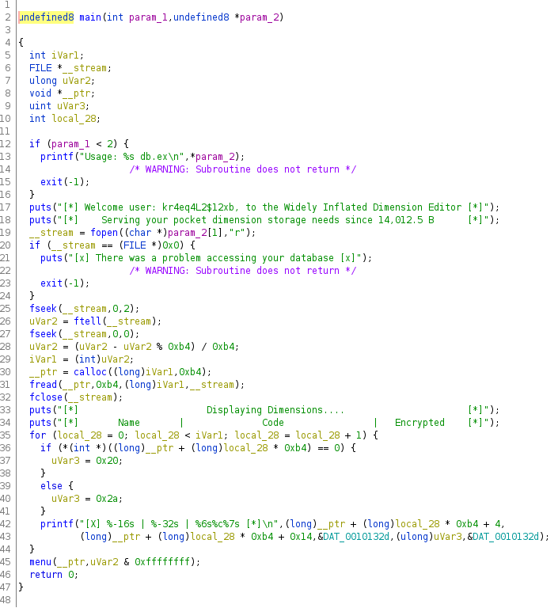
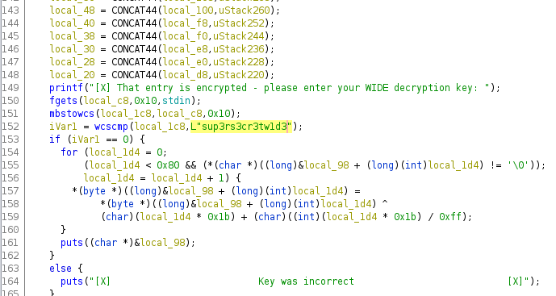

# Cyber Apocalypse 2022 CTF - Rev: Wide
---------------------------------------

In this challenge we are given an executable and a file named "*db.ex*".
Let's try and run the executable and see what happens.
We can input numbers and it seems that we can change the dimensions.
We can ttry some numbers. At number 6 we get to an encrypted dimension, where we need a password to proceed.
Obviously we don't have the password, so let's fire up Ghidra and look at the code.
We can navigate to the functions folder and look at the *main()* function.

There is nothing out of the ordinary, just some file checking. But in line 45 we call the function *menu()*
So let's have a look at that:

As we look through the *menu()* function we see the prompt for the decryption key in line 149.
A few lines below we see a *wcscmp()* function in line 152. This function compares our input with the string "*sup3rs3cr3tw1d3*".
We can assume that this is our encryption password, so let's try it and hope for the flag.
It worḱed! Our output is the flag **_HTB{str1ngs_4r3nt_4lw4ys_4sc11}_**

Decryption-Key = sup3rs3cr3tw1d3
HTB{str1ngs_4r3nt_4lw4ys_4sc11}